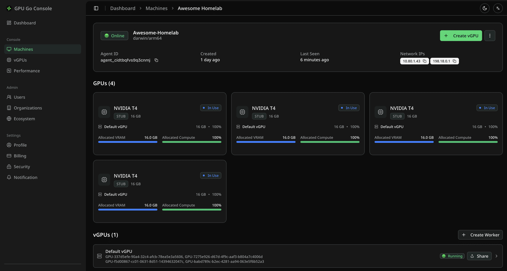

# GPU Go (ggo)

<div align="center">


**Use Remote GPUs Like They Are Local**

[](LICENSE)
[](https://goreportcard.com/report/github.com/NexusGPU/gpu-go)
[](https://github.com/NexusGPU/gpu-go/releases)

[Features](#features) • [Installation](#installation) • [Quick Start](#quick-start) • [VS Code Extension](#vs-code-extension) • [Documentation](#documentation)

</div>

---

## 🚀 Overview

**GPU Go (`ggo`)** is a cross-platform tool that transforms how you access and manage GPU resources. It allows developers to treat remote GPUs (on servers, cloud instances, or colleagues' machines) as if they were attached to their local development environment.

Think of it as **"NFS for GPUs"**: seamless, low-latency, and easy to manage.

### Why GPU Go?

- **Zero Friction**: Spin up a "Studio" environment with one command and get instant access to remote GPUs.
- **Cost Effective**: Share powerful GPU servers among multiple developers.
- **Cross-Platform**: Works on macOS (Apple Silicon or Intel), Windows (WSL), and Linux.
- **Flexible Backends**: Supports Docker, Colima, WSL, and Kubernetes.

<div align="center">
  <a href="https://tensor-fusion.ai/auth/login?callbackUrl=%2Fdashboard">
    
  </a>
</div>

## 📸 Screenshot

### Use Remote GPU in Local AI Studio

### Manage Fractional vGPUs

### Dashboard



## ✨ Features

- **🤖 Agent Mode**: Turn any machine with a GPU into a provider node in minutes.
- **🖥️ AI Studio**: One-click local development environments (Jupyter, VS Code Remote) connected to remote GPUs.
- **🔗 Smart Sharing**: Generate shareable links for temporary or long-term GPU access.
- **📦 Dependency Management**: Automatically handles vGPU libraries and drivers.
- **🔌 VS Code Integration**: Full GUI management via the official extension.

## 📥 Installation

### Quick Install (Recommended)

- [Register and follow dashboard instructions](https://tensor-fusion.ai/auth/login?callbackUrl=%2Fdashboard)

### Install Client Side via VSCode Extension

1. Go to Cursor/VSCode/Antigravity/Windsurf -> Extensions
2. Search "GPUGo"
3. Install from IDE

## GPUGo Binary (Optional)

### 1. Server Side: Share a GPU

Have a server with GPUs? Run the **Agent**.

```bash
# 1. Register the agent
ggo agent register -t "<token-from-dashboard>"

# 2. Start agent service
ggo agent start

# 3. Create a worker (a slice of GPU resource)
# Example: Share GPU 0 on port 9001
ggo worker create --name "Dev-Worker-1" --gpu-ids GPU-0 --port 9001
```

### 2. Client Side: Use a Remote GPU

Want to use a GPU for development? Create a **Studio** environment.

```bash
# Login first
ggo auth login

# List available GPU images
ggo studio images

# Create a studio environment connected to a remote GPU
# This sets up a local container (via Docker/Colima/WSL) bridged to the remote GPU
ggo studio create my-project -s "https://go.gpu.tf/s/share-code"

# Connect via SSH (automatically configures your ~/.ssh/config)
ggo studio ssh my-project
```

## 🧩 VS Code Extension

Prefer a GUI? The **GPU Go VS Code Extension** provides a beautiful interface to manage your studios, agents, and workers.

- Manage Studio environments
- Visualize GPU metrics (Usage, VRAM, Temp)
- One-click connect

👉 [Check out the VS Code Extension](./vscode-extension/README.md)

## 🏗 Architecture

GPU Go consists of three main components:

1.  **CLI (`ggo`)**: The unified command-line interface for both clients and servers.
2.  **Agent**: Runs on the GPU host, managing hardware isolation and exposing resources.
3.  **Studio**: Runs on the client machine, managing the containerized environment that consumes the remote GPU.

## 🤝 Contributing

We welcome contributions! Please see our [Contributing Guidelines](CONTRIBUTING.md) for details.

1.  Fork the repo
2.  Create your feature branch (`git checkout -b feature/amazing-feature`)
3.  Commit your changes
4.  Push to the branch
5.  Open a Pull Request

## 📄 License

This project is licensed under the Apache License 2.0 - see the [LICENSE](LICENSE) file for details.
